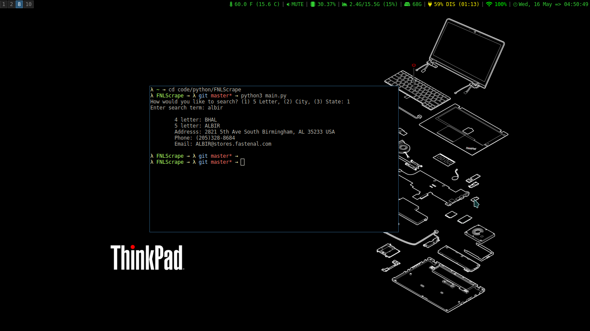

# Fastenal Store Finder

This works the same way as my other [project](https://github.com/ccam/Fastenal-store-finder)
I'm learning python so I decided to rewrite the app. It works in the console. I still need to leran how to catch all the exceptions and implement a solution for that.

## Install

1.  Clone project
2.  `pip install gspread oauth2client`
3.  Follow [this](http://gspread.readthedocs.io/en/latest/oauth2.html) tutorial to set up access with gspread and the google drive api to access the spread sheet.
4.  [This](https://docs.google.com/spreadsheets/d/1aQce2sKwar_xNUkr0zVch7CTiuxQvPl7-HDE7ajxDdI/edit?usp=sharing) is the spreadsheet copy it to your own Google Drive.
5.  navigate to project folder in your terminal
6.  `python3 main.py`

## Libraries used

1.  [gspread](https://github.com/burnash/gspread)
2.  [oauth2client](https://github.com/google/oauth2client)

## Screenshot

